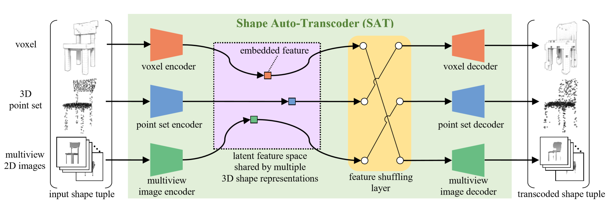

# ShapeAutoTranscoder
## Introduction
This repository provides the code of ShapeAutoTranscoder (SAT) for unsupervised learning of 3D shape feature proposed in the following paper.<br>
```
Takahiko Furuya and Ryutarou Ohbuchi,
"Transcoding across 3D Shape Representations for Unsupervised Learning of 3D Shape Feature",
Pattern Recognition Letters, 2020. DOI: https://doi.org/10.1016/j.patrec.2020.07.012)
```

SAT learns 3D shape feature via cross-predicting, or transcoding, multiple different 3D shape representations such as voxels, 3D point set, and multi-view 2D images. The embedded features in the latent space shared by the multiple 3D shape representations are used for 3D shape retrieval or 3D shape classification.
<br>

The instruction below describes how to prepare data and how to train/evaluate SAT using ModelNet10 dataset.

## Pre-requisites
Our code has been tested with Python 3.6, Tensorflow 1.13 and CUDA 10.0 on Ubuntu 18.04.<br>
Python packages required to run the code can be installed by executing the command below. <br>
```
pip install tensorflow-gpu==1.13.2 scikit-learn Pillow h5py sobol sobol_seq pyrr moderngl
```

## Preparing Data
1. Download ModelNet10.zip from [the project webpage of ModelNet](https://modelnet.cs.princeton.edu/) and unzip the downloaded file.

2. Convert the 3D shapes in OFF format to "shaperep" files that contain 3D shapes represented as voxels, 3D point sets, and multiview images. The following command creates the files in the data directory.<br>
    ```
    ./PrepareData.sh
    ```  
    * Note: it is recommended that "PrepareData.sh" is executed on a terminal launched on a window manager since it uses OpenGL for multiview rendering of 3D shapes. Running the code via SSH connection without X forwarding would abort with an error "Exception: cannot open display".

## Training SAT and evaluating learned 3D shape features
1. The following command starts training of SAT and computes retrieval accuracy in MAP at every 5 epochs.
    ```
    ./TrainAndTest.sh
    ```
